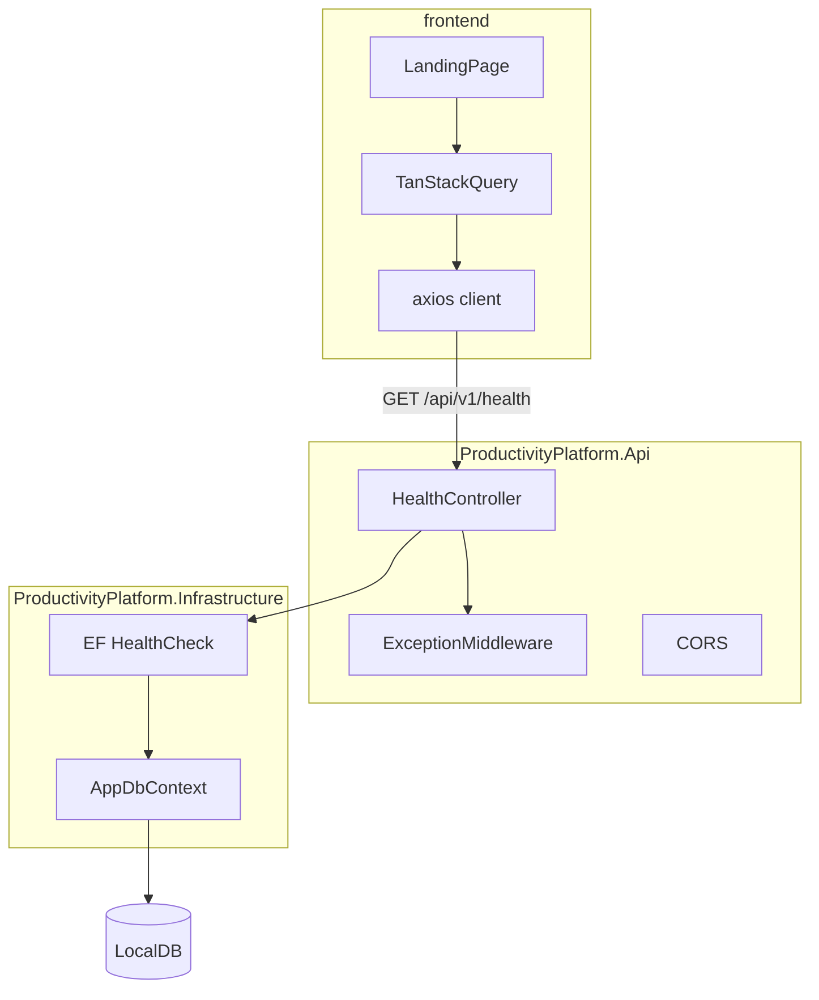
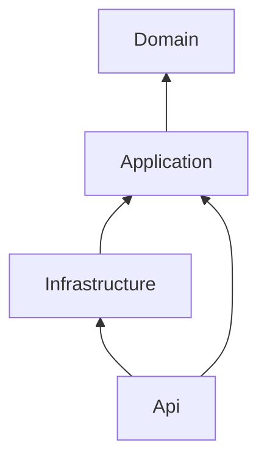

# Phase 01 — Project Setup

## Purpose

Establish a production-style repository skeleton with clear layering, tooling, and a working vertical slice (React → API → database) before any feature work begins. Phase 01 is the foundation every later phase builds on.

**Source of truth:** [productivity_platform_roadmap_2001c371.plan.md](e:\Projects\PersonalProductivityPlatform\.cursor\plans\productivity_platform_roadmap_2001c371.plan.md) (lines 311–330, 259–296, 644–658).

**Workspace state:** Greenfield — only [docs/Phase-01-Project-Vision.md](e:\Projects\PersonalProductivityPlatform\docs\Phase-01-Project-Vision.md) and [docs/Phase-02-Authentication.md](e:\Projects\PersonalProductivityPlatform\docs\Phase-02-Authentication.md) exist today.

---

## Resolved Decisions

These close the ambiguities identified in the roadmap:

| Decision | Choice | Rationale |
|----------|--------|-----------|
| Health endpoint path | `GET /api/v1/health` | Matches cross-phase `/api/v1/` versioning stub |
| API dev URL | `https://localhost:7187` | Standard .NET HTTPS launch profile |
| Frontend dev URL | `http://localhost:5173` | Vite default |
| Database | SQL Server LocalDB `(localdb)\mssqllocaldb` | Roadmap dev target |
| HTTP client | `axios` | Aligns with Phase 02 interceptor plan |
| Pre-commit hooks | Skip Husky in Phase 01 | Roadmap marks optional; add in Phase 11 CI |
| CQRS packages | Defer MediatR/FluentValidation wiring | Register project refs only; full CQRS starts Phase 02/03 |

---

## Target Architecture



**Project dependency graph (Clean Architecture):**



---

## Repository Layout

```
PersonalProductivityPlatform/
  backend/
    ProductivityPlatform.sln
    src/
      ProductivityPlatform.Api/
      ProductivityPlatform.Application/
      ProductivityPlatform.Domain/
      ProductivityPlatform.Infrastructure/
    tests/
      ProductivityPlatform.UnitTests/
      ProductivityPlatform.IntegrationTests/
  frontend/
    src/
      pages/           # LandingPage.tsx
      components/ui/   # shadcn components
      services/        # apiClient.ts, healthService.ts
      lib/             # queryClient.ts, cn.ts, utils
      types/           # api.ts (ApiResponse, HealthResponse)
  docs/
    Phase-01-Project-Setup.md   # NEW — detailed spec (this plan's content)
  ARCHITECTURE.md               # NEW — patterns stub
  README.md                     # NEW — local run instructions
  .editorconfig
  .gitignore
```

---

## Step 1 — Repository and Tooling

**Git**
- `git init` on `main`
- Trunk-based flow: short-lived `feature/phase-01-setup` branch, merge via PR
- Root [`.gitignore`](e:\Projects\PersonalProductivityPlatform\.gitignore): .NET (`bin/`, `obj/`, `*.user`), Node (`node_modules/`, `dist/`), IDE (`.vs/`, `.idea/`), secrets (`.env`, `appsettings.*.local.json`)

**Editor standards**
- Root [`.editorconfig`](e:\Projects\PersonalProductivityPlatform\.editorconfig): 4-space C#, 2-space TS/JSON, UTF-8, final newline

**Documentation (create before or alongside scaffold)**
- [docs/Phase-01-Project-Setup.md](e:\Projects\PersonalProductivityPlatform\docs\Phase-01-Project-Setup.md) — mirror Phase 02 doc style
- [README.md](e:\Projects\PersonalProductivityPlatform\README.md) — prerequisites (.NET 8 SDK, Node 20+, SQL Server LocalDB), run commands, URLs
- [ARCHITECTURE.md](e:\Projects\PersonalProductivityPlatform\ARCHITECTURE.md) — folder structure, dependency rules, `ApiResponse` contract, ADR-001 "modular monolith"

---

## Step 2 — Backend Scaffold

**Create solution and projects:**

```bash
cd backend
dotnet new sln -n ProductivityPlatform
dotnet new classlib -n ProductivityPlatform.Domain -o src/ProductivityPlatform.Domain -f net8.0
dotnet new classlib -n ProductivityPlatform.Application -o src/ProductivityPlatform.Application -f net8.0
dotnet new classlib -n ProductivityPlatform.Infrastructure -o src/ProductivityPlatform.Infrastructure -f net8.0
dotnet new webapi -n ProductivityPlatform.Api -o src/ProductivityPlatform.Api -f net8.0 --use-controllers
dotnet new xunit -n ProductivityPlatform.UnitTests -o tests/ProductivityPlatform.UnitTests -f net8.0
dotnet new xunit -n ProductivityPlatform.IntegrationTests -o tests/ProductivityPlatform.IntegrationTests -f net8.0
# Add to solution + set project references per dependency graph
```

**NuGet packages (Phase 01 only):**

| Project | Packages |
|---------|----------|
| Api | `Serilog.AspNetCore`, `Microsoft.AspNetCore.OpenApi`, `Swashbuckle.AspNetCore` |
| Infrastructure | `Microsoft.EntityFrameworkCore.SqlServer`, `Microsoft.EntityFrameworkCore.Design`, `Microsoft.Extensions.Diagnostics.HealthChecks.EntityFrameworkCore` |
| IntegrationTests | `Microsoft.AspNetCore.Mvc.Testing`, `Microsoft.EntityFrameworkCore.InMemory` (or Testcontainers later) |

**Domain foundation** ([`ProductivityPlatform.Domain`](e:\Projects\PersonalProductivityPlatform\backend\src\ProductivityPlatform.Domain)):
- `Common/Result.cs` — lightweight `Result` / `Result<T>` for later phases
- `Common/BaseEntity.cs` — `Id`, `CreatedAt`, `UpdatedAt` (UTC)

**Application foundation** ([`ProductivityPlatform.Application`](e:\Projects\PersonalProductivityPlatform\backend\src\ProductivityPlatform.Application)):
- `Common/ApiResponse.cs` — envelope: `{ data, errors, meta }`
- `DependencyInjection.cs` — empty `AddApplication()` stub for Phase 02+

**Infrastructure** ([`ProductivityPlatform.Infrastructure`](e:\Projects\PersonalProductivityPlatform\backend\src\ProductivityPlatform.Infrastructure)):
- `Persistence/AppDbContext.cs` — empty `DbSet`-less context for now
- `DependencyInjection.cs` — `AddInfrastructure(configuration)` registers DbContext + health checks
- Connection string in `appsettings.Development.json`:

```json
"ConnectionStrings": {
  "DefaultConnection": "Server=(localdb)\\mssqllocaldb;Database=ProductivityPlatform;Trusted_Connection=True;MultipleActiveResultSets=true;TrustServerCertificate=True"
}
```

- Run `dotnet ef migrations add InitialCreate` from Api project (design-time factory or `--project` / `--startup-project` flags)
- Run `dotnet ef database update`

**Api** ([`ProductivityPlatform.Api`](e:\Projects\PersonalProductivityPlatform\backend\src\ProductivityPlatform.Api)):
- `Program.cs` pipeline order: Serilog → exception middleware → HTTPS → CORS → routing → controllers
- `Middleware/ExceptionHandlingMiddleware.cs` — catch unhandled exceptions, return `ApiResponse` with 500 (no stack traces in prod)
- `Controllers/HealthController.cs` — `GET /api/v1/health`
- `appsettings.Development.json` — Serilog sinks (console + file optional)
- User Secrets for any sensitive overrides (JWT key placeholder for Phase 02)
- Swagger at `/swagger` in Development only
- CORS policy `AllowFrontend`: origin `http://localhost:5173`, allow credentials, any header/method

**Health endpoint contract:**

```
GET /api/v1/health
```

Response `200`:

```json
{
  "data": {
    "status": "Healthy",
    "timestamp": "2026-07-02T12:00:00Z",
    "version": "1.0.0",
    "database": "Connected"
  },
  "errors": null,
  "meta": null
}
```

Uses ASP.NET Core health checks (`AddDbContextCheck<AppDbContext>`) mapped through controller or `MapHealthChecks` wrapped in `ApiResponse`.

---

## Step 3 — Frontend Scaffold

**Create app:**

```bash
cd frontend
npm create vite@latest . -- --template react-ts
npm install
npm install @tanstack/react-query axios react-router-dom
npm install -D tailwindcss @tailwindcss/vite eslint prettier
npx shadcn@latest init   # New York style, zinc base, CSS variables
npx shadcn@latest add button card badge skeleton
```

**Key files:**

| File | Purpose |
|------|---------|
| [`frontend/src/lib/queryClient.ts`](e:\Projects\PersonalProductivityPlatform\frontend\src\lib\queryClient.ts) | TanStack Query defaults (staleTime, retry) |
| [`frontend/src/services/apiClient.ts`](e:\Projects\PersonalProductivityPlatform\frontend\src\services\apiClient.ts) | axios instance, `baseURL: https://localhost:7187/api/v1` |
| [`frontend/src/services/healthService.ts`](e:\Projects\PersonalProductivityPlatform\frontend\src\services\healthService.ts) | `getHealth()` → typed `ApiResponse<HealthData>` |
| [`frontend/src/types/api.ts`](e:\Projects\PersonalProductivityPlatform\frontend\src\types\api.ts) | Shared TS interfaces matching backend envelope |
| [`frontend/src/pages/LandingPage.tsx`](e:\Projects\PersonalProductivityPlatform\frontend\src\pages\LandingPage.tsx) | Calls health via `useQuery`, shows status card |
| [`frontend/vite.config.ts`](e:\Projects\PersonalProductivityPlatform\frontend\vite.config.ts) | Tailwind plugin, optional dev proxy (prefer explicit CORS for learning) |

**Landing page behavior:**
- Loading: shadcn `Skeleton`
- Success: green badge showing `status`, `database`, `version`
- Error: red card with message (proves CORS/connectivity debugging works)

**ESLint + Prettier:** extend `eslint-config-prettier`; add `format` and `lint` npm scripts.

---

## Step 4 — Integration Test

One test in [`ProductivityPlatform.IntegrationTests`](e:\Projects\PersonalProductivityPlatform\backend\tests\ProductivityPlatform.IntegrationTests):

```csharp
// HealthEndpointTests.cs
// WebApplicationFactory<Program> (expose Program via partial class or InternalsVisibleTo)
// GET /api/v1/health → 200, body contains "Healthy", database status present
```

Use in-memory EF provider or ensure LocalDB available in dev CI later (Phase 11).

---

## Step 5 — Verification (Exit Criteria)

Run manually and confirm:

| Check | Command / Action | Expected |
|-------|------------------|----------|
| API starts | `dotnet run --project backend/src/ProductivityPlatform.Api` | Listening on `https://localhost:7187` |
| Swagger | Browse `/swagger` | Health endpoint documented |
| DB migrated | `dotnet ef database update` | `ProductivityPlatform` DB exists in LocalDB |
| Frontend starts | `npm run dev` in `frontend/` | `http://localhost:5173` |
| E2E call | Open landing page | Shows "Healthy" + "Connected" from API |
| CORS | Browser network tab | No CORS errors |
| Test passes | `dotnet test` | Health integration test green |

---

## Review Checklist (before Phase 02)

**Repository**
- [ ] Git repo initialized on `main`
- [ ] `.gitignore` excludes secrets and build artifacts
- [ ] `README.md` documents local setup

**Backend**
- [ ] Clean Architecture projects with correct dependency direction
- [ ] `AppDbContext` registered; initial migration applied
- [ ] Serilog logging to console in Development
- [ ] Global exception middleware returns `ApiResponse` shape
- [ ] `GET /api/v1/health` returns DB status
- [ ] CORS allows `http://localhost:5173`
- [ ] Swagger enabled in Development

**Frontend**
- [ ] Vite + React + TypeScript + Tailwind + shadcn/ui scaffolded
- [ ] TanStack Query configured
- [ ] Landing page fetches and displays health status
- [ ] ESLint + Prettier run without errors

**Testing**
- [ ] One health endpoint integration test passes

**Documentation**
- [ ] `docs/Phase-01-Project-Setup.md` created
- [ ] `ARCHITECTURE.md` stub documents patterns for later phases

---

## Out of Scope (defer)

- MediatR, FluentValidation, AutoMapper registration (Phase 02/03)
- Authentication, entities beyond `BaseEntity` stub
- GitHub Actions CI (Phase 11)
- Husky pre-commit hooks (optional; CI covers lint in Phase 11)
- OpenAPI → TypeScript client generation (optional Phase 03)

---

## Suggested Weekly Rhythm (~8–12 hours)

1. **Day 1–2:** Repo, .NET solution, project references, Domain/Application stubs
2. **Day 3:** Infrastructure, EF Core, migration, Serilog, exception middleware
3. **Day 4:** Health controller, CORS, Swagger, integration test
4. **Day 5:** Vite + Tailwind + shadcn, axios + TanStack Query, landing page
5. **Day 6:** README, ARCHITECTURE.md, Phase-01 doc, review checklist
6. **Day 7:** "What I learned" notes (DI pipeline, Clean Architecture deps, CORS, health checks)

---

## Handoff to Phase 02

Once all review checklist items pass, proceed to [docs/Phase-02-Authentication.md](e:\Projects\PersonalProductivityPlatform\docs\Phase-02-Authentication.md). Phase 02 will add:
- `Users`, `Roles`, `UserRoles`, `RefreshTokens` tables via new migration
- MediatR + FluentValidation in Application layer
- JWT auth replacing the open health endpoint pattern for protected routes
