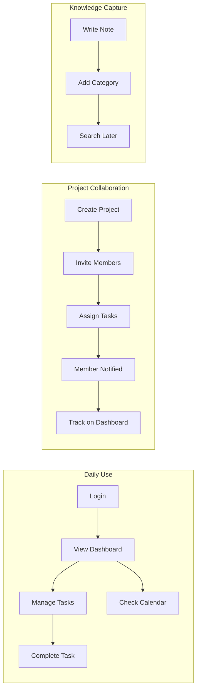
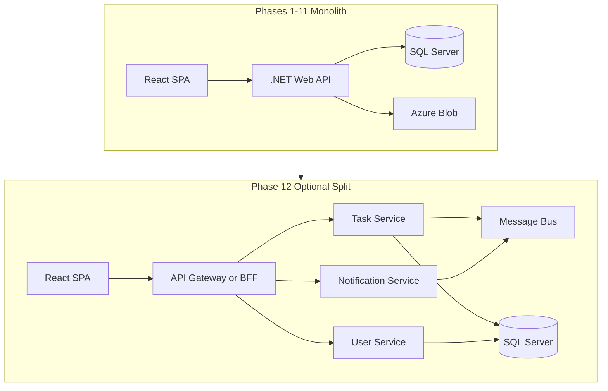
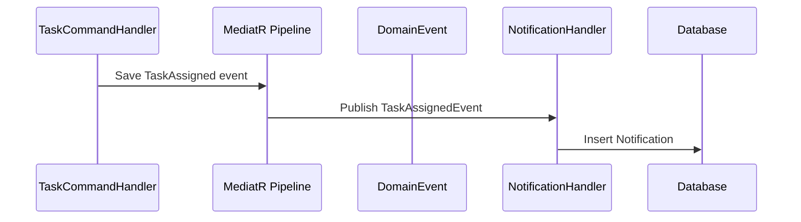
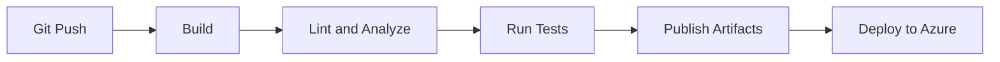

# Personal Productivity Platform — Phased Learning Roadmap

This plan builds on your existing drafts ([Phase-01-Project-Vision.md](e:\Projects\PersonalProductivityPlatform\Phase-01-Project-Vision.md), [Phase-02-Authentication.md](e:\Projects\PersonalProductivityPlatform\Phase-02-Authentication.md)) and extends them into a complete, step-by-step refresher. The workspace is greenfield — no code yet — so Phase 01 is your immediate starting point.

**Your choices:** Tailwind CSS + shadcn/ui | Hybrid pace (feature + light tests per phase; full suite in Phase 10)

---

## Project Description

### What We Are Building

**Personal Productivity Platform** is a full-stack web application that helps individuals and small teams organize their work in one place. It combines the most useful parts of tools like Notion, Trello, and Jira into a single, cohesive product — but deliberately scoped to stay achievable as a learning project.

At its core, the platform lets users **capture work** (tasks and notes), **organize it** (projects and calendar), **collaborate** (project members and assignments), **stay informed** (notifications), and **measure progress** (analytics dashboard). Over 12 phases, you will build this product end-to-end: from an empty repository to a deployed, monitored system on Azure.

This is not a toy todo list. It is a realistic, production-style application designed to mirror how modern software teams actually build — with proper layering, security, testing, CI/CD, and observability — while remaining small enough to complete step by step.

### The Problem It Solves

Knowledge workers and developers often scatter their work across multiple tools: tasks in one app, notes in another, deadlines in a calendar, and progress tracked manually. This fragmentation creates friction — things get missed, context is lost, and there is no single view of productivity.

This platform addresses that by providing:

- A **unified workspace** where tasks, notes, and deadlines live together
- **Project-based organization** so work can be grouped and shared with others
- **Proactive reminders** so due dates and assignments do not slip through
- **Visibility** into what is done, what is overdue, and how productivity trends over time

### Target Users

| User | How They Use the Platform |
|------|---------------------------|
| **Individual** | Manage personal tasks, write notes, track deadlines on a calendar, review weekly progress |
| **Project owner** | Create a project, invite members, assign tasks, monitor team progress on a dashboard |
| **Team member** | View assigned tasks, update status, attach files, receive notifications when work changes |
| **Administrator** | Manage users, roles, and permissions across the system |

For this learning project, you will build for all four personas — starting with the individual user in early phases and adding collaboration and admin capabilities as the system grows.

### Core Modules

#### 1. Task Management
The foundation of the platform. Users create tasks with a title, description, priority (Low → Critical), status (Todo / In Progress / Done), and optional due date. Tasks can be filtered, sorted, completed, reopened, and eventually assigned to projects and other users. This module teaches CRUD operations, validation, pagination, and basic authorization.

#### 2. Projects
Projects group related tasks under a shared context — for example, "Home Renovation" or "Sprint 12". Each project has an owner, members with roles (Owner / Member / Viewer), and its own task list. This introduces relational database design (many-to-many), resource-level authorization, and collaborative workflows.

#### 3. Notes
A rich-text notes module for capturing ideas, meeting notes, or documentation linked to a project. Notes support categories/tags and full-text search so users can find content quickly. This module teaches content storage, search indexing, and XSS prevention.

#### 4. Calendar
A visual timeline showing task due dates and standalone events across month, week, and day views. Users can drag tasks to reschedule deadlines directly on the calendar. This module teaches date-range queries, timezone handling (UTC storage, local display), and interactive UI integration.

#### 5. Notifications
An in-app notification center that alerts users when tasks are assigned to them, completed by a teammate, or approaching their due date. Notifications are generated via domain events and background jobs — introducing event-driven architecture within the monolith. This mirrors patterns used in enterprise systems where actions trigger downstream side effects.

#### 6. Analytics Dashboard
A summary view showing productivity metrics: tasks completed this week, overdue count, breakdown by status and priority, completion trends over time, and per-project progress. This module teaches aggregation queries, charting, query performance, and optional caching.

#### 7. File Attachments
Users can attach files (documents, images) to tasks, stored securely in Azure Blob Storage. Supports upload, preview, download, and delete with file type/size validation. This module teaches cloud storage integration and secure file handling.

#### 8. Authentication & Administration
Secure user registration, login, JWT-based sessions with refresh tokens, password reset, and role-based access control. Administrators manage users and permissions. Built in Phase 02, this underpins every other module.

### Key User Workflows



**Workflow 1 — Daily productivity:** Log in → review dashboard for overdue items → check calendar for today's deadlines → complete or update tasks → receive notification when a teammate assigns new work.

**Workflow 2 — Project collaboration:** Create a project → invite team members → assign tasks with due dates → members update status → project owner monitors progress on the dashboard.

**Workflow 3 — Knowledge capture:** Write a rich-text note during a meeting → tag it with a category → link it to a project → find it later via search.

### What the Finished Product Looks Like

When all 12 phases are complete, you will have:

- A **React SPA** with a polished UI (Tailwind + shadcn/ui) — responsive layout, forms, tables, charts, rich text editor, and calendar
- A **.NET 8 Web API** following Clean Architecture with CQRS (MediatR), validation, and structured error handling
- A **SQL Server database** with normalized schema, migrations, indexes, and full-text search
- **Secure authentication** with JWT, refresh tokens, and role-based authorization
- **Event-driven notifications** with background job processing
- **Azure cloud deployment** with Blob Storage for files and Application Insights for monitoring
- **CI/CD pipeline** that builds, tests, and deploys automatically on every merge
- An optional **microservices capstone** extracting the notification service behind a message bus

### Scope Boundaries

**In scope (what we build):**
- Single-page React application consuming a REST API
- Modular monolith backend (decomposed optionally in Phase 12)
- SQL Server relational database with EF Core migrations
- In-app notifications (not email/SMS in core phases)
- Azure deployment with GitHub Actions

**Out of scope (intentionally excluded to keep focus):**
- Mobile native apps
- Real-time collaboration (live cursors, WebSockets) — stretch goal only
- Third-party integrations (Slack, Google Calendar sync)
- Multi-tenancy / SaaS billing
- Email delivery infrastructure (stub/mock in dev; stretch in Phase 02)

Keeping clear boundaries ensures each phase delivers a complete, testable slice without scope creep.

### Dual Purpose: Product + Learning Vehicle

Every feature serves two goals simultaneously:

1. **Product value** — the feature works and would be usable by a real user
2. **Learning value** — the feature teaches specific software engineering concepts

| Phase | Product Deliverable | Engineering Concepts Practiced |
|-------|--------------------|---------------------------------|
| 01 | Running app skeleton | Project structure, tooling, environment config |
| 02 | Login/register system | JWT, RBAC, security, password hashing |
| 03 | Task manager | CRUD, API design, EF Core, validation |
| 04 | Project collaboration | Relationships, resource authorization |
| 05 | Notes with search | Indexing, content sanitization, FTS |
| 06 | Calendar view | Date queries, timezones, interactive UI |
| 07 | Notification center | Domain events, background jobs |
| 08 | Analytics dashboard | Aggregations, reporting, performance |
| 09 | File attachments | Cloud storage, secure uploads |
| 10 | Test suite | TDD, mocking, test pyramid |
| 11 | Automated deployment | CI/CD, Azure, release management |
| 12 | Production monitoring | Observability, microservice decomposition |

### Module Summary

| Module | Purpose |
|--------|---------|
| Tasks | CRUD, priority, due dates, status |
| Projects | Group tasks, members, permissions |
| Notes | Rich text, categories, search |
| Calendar | Due dates and events on a timeline |
| Notifications | Reminders, assignments, completions |
| Dashboard | Productivity metrics and charts |
| Attachments | Files on tasks via Azure Blob |
| Auth & Admin | Secure access, user/role management |

Reference products: **Notion** (notes) + **Trello** (tasks/boards) + **Jira** (projects/assignments) — simplified into one cohesive platform.

---

## Technology Stack

**Frontend:** React 18, TypeScript, Vite, React Router, TanStack Query, React Hook Form + Zod, Tailwind CSS, shadcn/ui, Recharts (dashboard), TipTap or Lexical (rich notes), FullCalendar (calendar)

**Backend:** .NET 8 Web API, Clean Architecture, MediatR (CQRS), FluentValidation, EF Core, Serilog, AutoMapper (optional)

**Database:** SQL Server (LocalDB for dev, Azure SQL for prod)

**DevOps:** Git, GitHub, GitHub Actions, Azure App Service, Azure Blob Storage, Application Insights

---

## Architecture Evolution

Start as a **modular monolith** (correct for learning). Decompose only after Phase 11 when the domain is understood.



**Backend folder structure** (create in Phase 01):

```
backend/
  src/
    ProductivityPlatform.Api/           # Controllers, middleware, DI bootstrap
    ProductivityPlatform.Application/   # Commands, queries, handlers, DTOs, validators
    ProductivityPlatform.Domain/        # Entities, enums, domain events, interfaces
    ProductivityPlatform.Infrastructure/ # EF Core, repos, email, blob, identity
  tests/
    ProductivityPlatform.UnitTests/
    ProductivityPlatform.IntegrationTests/
```

**Frontend folder structure:**

```
frontend/
  src/
    pages/          # Route-level screens
    components/     # Reusable UI (shadcn in components/ui/)
    features/       # Feature modules (tasks/, projects/, auth/)
    services/       # API clients (axios/fetch wrappers)
    hooks/          # Custom hooks (useAuth, useTasks)
    layouts/        # AppShell, AuthLayout
    routes/         # Route definitions + guards
    types/          # Shared TS interfaces
    lib/            # Utils, queryClient, cn()
```

**Cross-cutting patterns used throughout:**

- **Clean Architecture:** Domain has no dependencies; Application depends on Domain; Infrastructure implements interfaces
- **CQRS via MediatR:** `CreateTaskCommand`, `GetTasksQuery` with handlers
- **Repository + Unit of Work:** EF Core behind interfaces in Domain/Application
- **Result pattern:** `Result<T>` instead of throwing for expected failures
- **Global exception middleware:** Consistent API error responses
- **ApiResponse envelope:** `{ data, errors, meta }` for predictable frontend handling

---

## Hybrid Pace Rules

Each phase (except 10–12):

1. Build the **vertical slice** (DB migration → API → UI)
2. Write **2–5 focused tests** (one validator, one handler, one API integration, one component)
3. Complete the **review checklist** before advancing
4. Defer comprehensive coverage, E2E, and CI to Phases 10–11

---

## Phase 01 — Project Setup (Week 1)

**Goal:** Professional repo skeleton, tooling, and "hello world" end-to-end.

**Tasks:**

- Initialize Git repo; adopt **trunk-based** flow: `main` + short-lived `feature/*` branches
- Scaffold .NET solution with Clean Architecture projects listed above
- Scaffold React + Vite + TypeScript + Tailwind + shadcn/ui
- Add SQL Server (LocalDB); wire EF Core `DbContext` with empty migration
- Configure: Swagger/OpenAPI, Serilog, `appsettings.Development.json`, User Secrets
- Configure: ESLint, Prettier, EditorConfig, `.gitignore`, Husky (optional pre-commit lint)
- Create health check endpoint: `GET /api/health`
- Create landing page that calls health check via TanStack Query

**Concepts:** Repo structure, environment config, DI, middleware pipeline, coding standards, API contracts

**Light tests:** One integration test for health endpoint

**Exit criteria:** `dotnet run` + `npm run dev` both work; Swagger loads; one API call from React succeeds

---

## Phase 02 — Authentication & Authorization (Week 2)

**Follow your existing draft** ([Phase-02-Authentication.md](e:\Projects\PersonalProductivityPlatform\Phase-02-Authentication.md)) with these additions:

**Database tables:**

- `Users`, `Roles`, `UserRoles`, `RefreshTokens`
- Add `Permissions`, `RolePermissions` (stretch within phase — teaches RBAC beyond simple roles)

**Backend tasks:**

- MediatR commands: `RegisterUser`, `LoginUser`, `RefreshToken`, `Logout`, `ForgotPassword`, `ResetPassword`
- FluentValidation on all auth DTOs
- JWT access token (15 min) + refresh token (7 days, rotated on use)
- Password hashing via ASP.NET Core `PasswordHasher<T>`
- Authorization policies: `[Authorize(Roles = "Admin")]`, resource-based checks stub for later phases
- Implement all endpoints from your draft (lines 256–270)

**Frontend tasks:**

- shadcn forms: Login, Register, Forgot Password
- Auth context + TanStack Query mutations
- Axios/fetch interceptor: attach JWT, refresh on 401
- Protected route wrapper; redirect unauthenticated users

**Concepts:** JWT, claims, RBAC, OWASP auth basics, middleware order, secure token storage (memory + httpOnly cookie for refresh OR refresh in secure cookie — pick one and document it)

**Light tests:** Password hasher unit test, login handler test, register API integration test, login form render test

**Exit criteria:** Use your draft's review checklist (lines 372–410)

---

## Phase 03 — Task Management (Week 3)

**Features:** Create, read, update, delete, complete, reopen; priority (Low/Medium/High/Critical); due date; status (Todo/InProgress/Done)

**Database:**

```
Tasks: Id, Title, Description, Status, Priority, DueDate, CreatedByUserId, CreatedAt, UpdatedAt, CompletedAt
TaskStatus / TaskPriority as enums in Domain (not lookup tables yet)
```

**Backend:**

- Full CRUD via MediatR + FluentValidation
- Pagination: `GET /api/tasks?page=1&pageSize=20&status=Todo`
- Filtering and sorting query params
- User can only access own tasks (authorization rule)

**Frontend:**

- Task list with shadcn Table or Card layout
- Create/Edit modal with React Hook Form + Zod
- Filters (status, priority), sort by due date
- Empty states, loading skeletons, toast notifications

**Concepts:** CRUD API design, REST conventions, EF Core mappings, DTOs vs entities, validation at boundary, optimistic updates with TanStack Query

**Light tests:** CreateTask validator, GetTasks handler, CRUD integration test, TaskList component test

---

## Phase 04 — Projects (Week 4)

**Features:** Create project, edit, archive; add/remove members; assign tasks to project; project-scoped task list

**Database:**

```
Projects: Id, Name, Description, OwnerUserId, CreatedAt, IsArchived
ProjectMembers: ProjectId, UserId, Role (Owner/Member/Viewer)
Tasks: add ProjectId (nullable FK)
```

**Backend:**

- Many-to-many: Project ↔ User via ProjectMembers
- Authorization: only members can view; Owner/Member can edit tasks; Viewer read-only
- Endpoints: `/api/projects`, `/api/projects/{id}/members`, `/api/projects/{id}/tasks`

**Frontend:**

- Project sidebar or board view
- Member management UI (invite by email — lookup existing users)
- Project dashboard stub (task counts by status)

**Concepts:** EF relationships, many-to-many, authorization at resource level, domain invariants (e.g., project must have one Owner)

**Light tests:** Authorization policy test (non-member denied), assign task to project integration test

---

## Phase 05 — Notes Module (Week 5)

**Features:** Rich text notes, categories/tags, full-text search, link note to project (optional)

**Database:**

```
Notes: Id, Title, Content (HTML/JSON), UserId, ProjectId?, CreatedAt, UpdatedAt
Categories: Id, Name, UserId
NoteCategories: NoteId, CategoryId
```

**Backend:**

- TipTap JSON or HTML storage; sanitize on write
- Search: SQL Server Full-Text Search index on Title + Content (or `LIKE` first, FTS as stretch)
- Pagination + search endpoint: `GET /api/notes?search=term&categoryId=`

**Frontend:**

- Rich text editor (TipTap + shadcn toolbar)
- Category filter chips
- Search bar with debounce

**Concepts:** Indexing, search optimization, content sanitization (XSS prevention), optional FTS

**Light tests:** Search query handler, XSS sanitization unit test

---

## Phase 06 — Calendar (Week 6)

**Features:** Calendar view of task due dates; create/edit task due date from calendar; optional standalone events

**Database:**

```
CalendarEvents: Id, Title, StartDate, EndDate, AllDay, UserId, TaskId?, ProjectId?
(Tasks.DueDate remains; events can exist without tasks)
```

**Backend:**

- `GET /api/calendar?start=&end=` returns tasks + events in range
- CRUD for standalone events

**Frontend:**

- FullCalendar (month/week/day views)
- Drag-to-reschedule due dates (updates task via API)
- Color-code by project or priority

**Concepts:** Date-range queries, timezone handling (store UTC, display local), UI state sync

**Light tests:** Date-range query unit test, calendar API integration test

---

## Phase 07 — Notifications (Week 7)

**Features:** In-app notification center; triggers: due date reminder, task assigned, task completed

**Database:**

```
Notifications: Id, UserId, Type, Title, Message, IsRead, CreatedAt, RelatedEntityType, RelatedEntityId
```

**Backend (event-driven within monolith):**



- Domain events: `TaskAssignedEvent`, `TaskCompletedEvent`, `DueDateApproachingEvent`
- MediatR `INotificationHandler<T>` for side effects
- Background job: `IHostedService` or Hangfire (Hangfire teaches job dashboards — recommended) to scan due dates daily

**Frontend:**

- Notification bell with unread count
- Mark as read, mark all read

**Concepts:** Event-driven design, eventual consistency, background jobs, idempotent handlers

**Light tests:** Event handler creates notification; background job integration test (or unit test with mocked clock)

---

## Phase 08 — Analytics Dashboard (Week 8)

**Features:** Tasks completed this week, overdue count, tasks by status/priority, productivity trend chart, per-project breakdown

**Backend:**

- Aggregation queries (raw SQL or EF Core GroupBy)
- `GET /api/dashboard/summary`, `/api/dashboard/charts?range=30d`
- Consider read-optimized DTOs; add indexes on `CompletedAt`, `DueDate`, `Status`

**Frontend:**

- shadcn Card stat widgets
- Recharts: bar chart (tasks by status), line chart (completions over time)
- Date range selector

**Concepts:** Reporting queries, N+1 avoidance, indexing for aggregations, caching (optional: `IMemoryCache` with 5-min TTL)

**Light tests:** Dashboard query returns correct counts with seed data

---

## Phase 09 — File Uploads (Week 9)

**Features:** Attach files to tasks; preview images; download; delete

**Storage:** Azure Blob Storage (Azurite emulator locally)

**Database:**

```
Attachments: Id, TaskId, FileName, BlobUrl, ContentType, SizeBytes, UploadedByUserId, UploadedAt
```

**Backend:**

- SAS token or server-side upload endpoint
- Validate file type/size; virus scan stub
- Authorization: task owner/project member only

**Frontend:**

- Drag-and-drop upload zone on task detail
- File list with download link

**Concepts:** Cloud storage, secure URLs, streaming uploads, content-type validation

**Light tests:** File size validation, unauthorized upload rejected

---

## Phase 10 — Comprehensive Testing (Week 10)

**Goal:** Backfill test pyramid across the whole system.

**Backend:**

- Unit tests: all validators, key handlers, domain logic
- Integration tests: WebApplicationFactory per module (auth, tasks, projects)
- Testcontainers or LocalDB for DB tests

**Frontend:**

- Vitest + React Testing Library: forms, hooks, key pages
- MSW (Mock Service Worker) for API mocking

**Concepts:** Test pyramid, mocking, fixtures, test data builders, coverage targets (aim 70%+ on Application layer)

**Deliverable:** Test report in CI; document how to run `dotnet test` and `npm test`

---

## Phase 11 — DevOps & CI/CD (Week 11)

**GitHub Actions workflows:**



- **CI** (on PR): build .NET + React, ESLint, `dotnet format --verify-no-changes`, run tests
- **CD** (on merge to main): deploy API to Azure App Service, React to Static Web Apps or App Service, run EF migrations against Azure SQL
- Environments: `dev` → `staging` → `prod` (start with dev only)
- Secrets: GitHub Secrets for connection strings, JWT key

**Concepts:** Pipeline as code, artifact publishing, environment promotion, database migrations in deployment

---

## Phase 12 — Monitoring & Architecture Evolution (Week 12+)

**Part A — Observability:**

- Serilog structured logging (JSON in prod)
- Application Insights: request tracking, dependencies, exceptions
- Custom metrics: login failures, task creation rate
- Health checks: `/health` (DB + blob)

**Part B — Microservices exercise (optional capstone):**

Extract **Notification Service** first (smallest, event-driven):

1. Move notification handlers to a separate ASP.NET project
2. Introduce Azure Service Bus or RabbitMQ (local Docker)
3. Task service publishes `TaskAssignedEvent` to queue
4. Notification service consumes and writes to shared or separate DB

This mirrors enterprise patterns (similar to event-driven systems you may have seen at Baseplan) without over-engineering early.

**Concepts:** Observability, distributed tracing, service boundaries, message contracts, strangler fig pattern

---

## Cross-Phase Best Practices Checklist

Apply these from Phase 01 onward:

| Practice | Where |
|----------|-------|
| Conventional commits | Every commit |
| PR descriptions with test plan | Every merge |
| API versioning stub (`/api/v1/`) | Phase 01 |
| OpenAPI → TypeScript client generation (optional) | Phase 03 |
| EF Core migrations only (never manual prod DDL) | All DB phases |
| UTC timestamps everywhere | All entities |
| Soft delete where appropriate (Notes, Projects) | Phase 04–05 |
| Rate limiting on auth endpoints | Phase 02 |
| CORS configured explicitly | Phase 01 |

---

## Suggested Weekly Rhythm

Each week (~8–12 hours):

1. **Day 1–2:** Read phase doc, design DB schema, write migration
2. **Day 3–4:** Backend commands/queries + API endpoints
3. **Day 5:** Frontend screens + API integration
4. **Day 6:** Light tests + review checklist
5. **Day 7:** Write a short "what I learned" note (great for interview prep — your Phase 02 draft already has interview questions; replicate that per phase)

---

## Documentation To Create in This Workspace

Extend your existing drafts with one file per remaining phase:

- `Phase-03-Task-Management.md` through `Phase-12-Monitoring-Evolution.md`
- `ARCHITECTURE.md` — folder structure, patterns, ADRs
- `README.md` — how to run locally

---

## Immediate Next Step

Execute **Phase 01** in this workspace:

1. Initialize the Git repo and folder structure above
2. Scaffold backend Clean Architecture solution + frontend Vite app
3. Wire health check end-to-end
4. Confirm Swagger + React dev server + LocalDB migration all run cleanly

Once Phase 01 exit criteria pass, proceed to Phase 02 using your existing [Phase-02-Authentication.md](e:\Projects\PersonalProductivityPlatform\Phase-02-Authentication.md) as the detailed spec.
